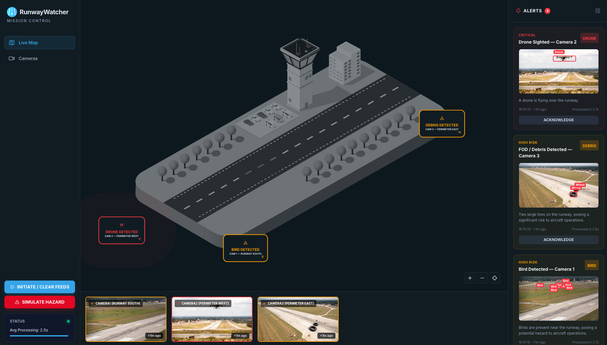

# Runway Watcher

Airport runway hazard detection and monitoring system. Provides a real-time dashboard for tracking hazards (birds, drones, debris, vehicles) detected by cameras positioned around an airport.



## Architecture

```
┌──────────────┐     ┌──────────────┐     ┌─────────────────┐
│  CloudFront  │────▶│  S3 (Static  │     │  API Gateway    │
│  Distribution│     │   Hosting)   │     │  (REST API)     │
└──────────────┘     └──────────────┘     └────────┬────────┘
                                                   │
                                    ┌──────────────┼──────────────┐
                                    │              │              │
                              ┌─────▼──────┐ ┌─────▼─────┐ ┌─────▼─────┐
                              │ get-latest │ │ get-alerts│ │acknowledge│
                              │  -images   │ │           │ │  -alert   │
                              └─────┬──────┘ └─────┬─────┘ └───────────┘
                                    │              │
                              ┌─────▼──────────────▼────────────────────┐
                              │              DynamoDB                   │
                              │         (Single-Table Design)           │
                              └──────┬───────────────────┬──────────────┘
                                     │ Streams           │ Streams
                               ┌─────▼──────┐     ┌──────▼──────────┐
                               │  analyse-  │     │  EventBridge    │
                               │   hazard   │     │  Pipe + Lambda  │
                               │ (Durable)  │     │  (enrichment)   │
                               └──┬─────┬───┘     └───────┬─────────┘
                                  │     │                  │
                         ┌────────▼┐  ┌─▼───────────┐  ┌───▼──────────┐
                         │Rekognit-│  │  Bedrock    │  │  AppSync     │
                         │  ion    │  │  Nova Pro   │  │  Events API  │
                         └─────────┘  └─────────────┘  └──────────────┘

  EventBridge (1-min schedule) ──▶ upload-images ──▶ S3 (Camera Images)
  EventBridge (S3 Object Created) ──▶ process-image ──▶ DynamoDB
```

### How It Works

1. **Image ingestion** — An EventBridge rule triggers the `upload-images` Lambda every minute, uploading sample camera images to S3 with configurable per-camera probability.
2. **Image processing** — S3 object creation events (via EventBridge) trigger `process-image`, which writes latest-image metadata to DynamoDB with `PK=LATEST`.
3. **Hazard analysis** — DynamoDB Streams triggers the `analyse-hazard` durable Lambda when a `LATEST` record is inserted or modified. This runs a checkpointed multi-step workflow:
   - Classifies the image using Amazon Rekognition (`DetectLabels`)
   - Sends the image bytes to Amazon Nova Pro via the Bedrock Converse API for visual verification and severity assessment
   - Writes an alert record (`PK=ALERT`) to DynamoDB if a real hazard is confirmed
4. **Real-time alerts** — An EventBridge Pipe listens for new `ALERT` records on the DynamoDB stream, enriches them via a Lambda function, and publishes to an AppSync Events API for WebSocket delivery to the frontend.
5. **API layer** — API Gateway exposes endpoints for camera feeds, alerts, alert acknowledgement, and test triggers.
6. **Frontend** — React SPA polls the API for live camera feeds (30s) and alerts (15s), and receives real-time alert push via AppSync Events WebSocket. Renders an interactive airport map with camera markers and status indicators.

## Project Structure

```
runway-watcher/
├── frontend/                  # React SPA (Vite + Tailwind + TypeScript)
│   ├── public/config.js       # Runtime config (replaced at deploy time)
│   ├── src/App.tsx             # Main application (all views, hooks, map)
│   └── src/config.ts           # Runtime config loader
│
├── backend/                   # Lambda handlers (TypeScript)
│   ├── upload-images.ts       # Scheduled: uploads camera images to S3
│   ├── process-image.ts       # EventBridge: writes image metadata to DynamoDB
│   ├── get-latest-images.ts   # API: returns camera feeds with presigned URLs
│   ├── get-alerts.ts          # API: queries DynamoDB for alerts
│   ├── acknowledge-alert.ts   # API: marks an alert as acknowledged in DynamoDB
│   ├── analyse-hazard.ts      # DynamoDB Streams: durable hazard analysis workflow
│   └── alert-enrichment.ts    # EventBridge Pipe: enriches alert events for AppSync
│
├── infrastructure/            # AWS CDK stacks
│   ├── lib/
│   │   ├── stateful-stack.ts  # DynamoDB + S3 camera images bucket
│   │   ├── stateless-stack.ts # API Gateway + Lambdas + Bedrock + AppSync Events + pipes
│   │   └── frontend-stack.ts  # S3 + CloudFront + runtime config injection
│   ├── constructs/            # Reusable CDK constructs (CustomLambda, CustomTable)
│   └── config/                # Stage-based environment config (dev/prod)
│
└── resources/
    └── camera-images/         # Sample images bundled with upload-images Lambda
```

## Prerequisites

- Node.js 22+
- npm 10+
- AWS CLI configured with appropriate credentials
- AWS CDK CLI (`npm install -g aws-cdk`)

## Getting Started

```bash
# Install all workspace dependencies
npm install

# Start the frontend dev server
npm run frontend
```

### Local Development

Copy the example env files and configure them:

```bash
# Frontend — set your API URL
cp frontend/.env.local.example frontend/.env.local

# Backend — for local testing with SAM or similar
cp local.env.json.example local.env.json
```

`frontend/.env.local`:
```
VITE_API_URL=https://your-api-gateway-url.execute-api.eu-west-1.amazonaws.com/prod
```

`local.env.json`:
```json
{
  "POWERTOOLS_LOG_LEVEL": "DEBUG",
  "TABLE_NAME": "RunwayWatcherTable",
  "BUCKET_NAME": "your-camera-images-bucket"
}
```

## Scripts

Run from the repo root:

| Command                    | Description                        |
|----------------------------|------------------------------------|
| `npm run frontend`         | Start frontend dev server (Vite)   |
| `npm run build:frontend`   | Build frontend for production      |
| `npm run build:backend`    | Bundle backend Lambda handlers     |
| `npm run build:infra`      | Compile infrastructure TypeScript  |
| `npm run lint`             | Lint frontend (ESLint)             |
| `npm run test:infra`       | Run infrastructure tests (Jest)    |
| `npm run synth`            | CDK synth                          |
| `npm run deploy`           | CDK deploy all stacks              |
| `npm run deploy:backend`   | Deploy stateless stack only        |
| `npm run deploy:frontend`  | Deploy frontend stack only         |

Target a specific workspace:

```bash
npm run <script> -w frontend
npm run <script> -w infrastructure
npm run <script> -w backend
```

## Deployment

```bash
# Synthesize CloudFormation templates
npm run synth

# Deploy all three stacks
npm run deploy
```

This deploys three stacks:

- **RunwayWatcherStatefulStack** — DynamoDB table (single-table, PK/SK, streams enabled) and S3 bucket (1-day lifecycle, EventBridge enabled)
- **RunwayWatcherStatelessStack** — API Gateway, six Lambda functions, Bedrock Nova Pro integration, AppSync Events API, EventBridge Pipe, SNS topic, SQS queue, EventBridge rules
- **RunwayWatcherFrontendStack** — S3 static hosting, CloudFront distribution, runtime config injection via `AwsCustomResource`

### Runtime Config

The frontend uses a `window.__RUNTIME_CONFIG__` pattern. During deployment, CDK writes a `config.js` file to S3 containing the resolved API Gateway URL, AppSync Events endpoint, and API key. In local dev, `VITE_API_URL` from `.env.local` takes precedence.

## Tech Stack

### Frontend
- React 19, TypeScript 5.9, Vite 7
- Tailwind CSS 4, Framer Motion, Recharts, Lucide React
- ESLint 9 (flat config)

### Backend
- TypeScript 5.9 Lambda handlers (bundled by CDK/esbuild)
- AWS SDK v3 (DynamoDB, S3, Rekognition, Bedrock Runtime)
- AWS Lambda Durable Execution SDK for checkpointed workflows
- AWS Lambda Powertools (logging, tracing, metrics)

### Infrastructure
- AWS CDK v2 with cdk-nag (AwsSolutionsChecks)
- AppSync Events API with EventBridge Pipes for real-time WebSocket delivery
- Custom constructs: `CustomLambda` (ARM64, Powertools, esbuild, X-Ray) and `CustomTable` (PAY_PER_REQUEST, PITR)
- TypeScript path aliases: `@config`, `@constructs`, `@utils`

## API Endpoints

| Method | Path                          | Description                                       |
|--------|-------------------------------|---------------------------------------------------|
| GET    | `/cameras/latest`             | Returns latest camera images with presigned URLs  |
| GET    | `/cameras/alerts`             | Returns alert records from DynamoDB               |
| POST   | `/cameras/alerts/acknowledge` | Acknowledges an alert by ID                       |
| POST   | `/simulate-hazard`            | Triggers a camera image upload (for testing)      |
| POST   | `/initiate-feeds`             | Initiates camera feed uploads                     |

## License

GNU General Public License v3.0
